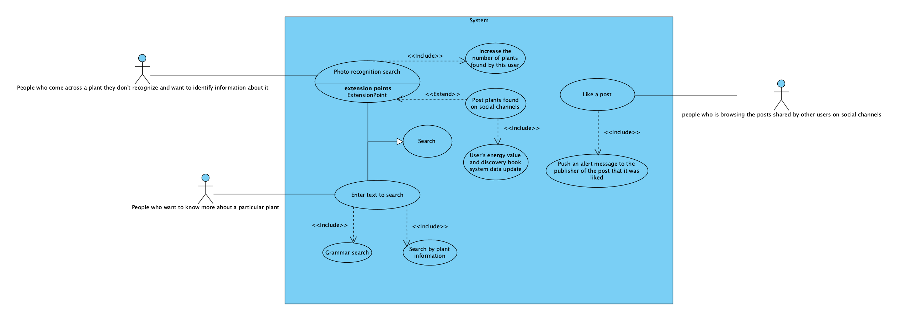
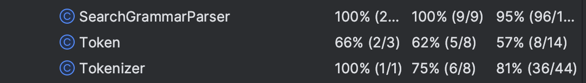
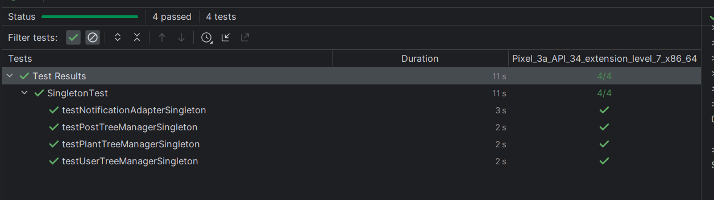
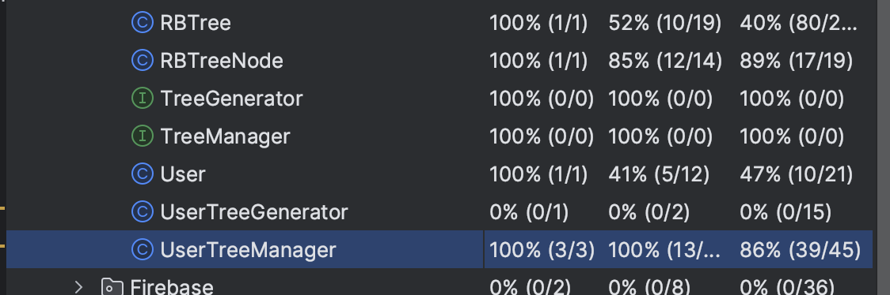
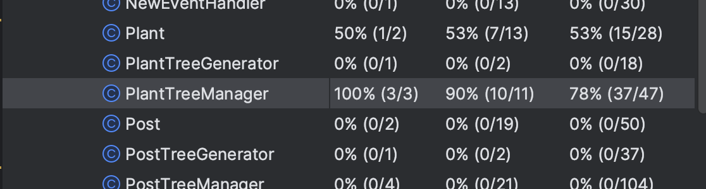
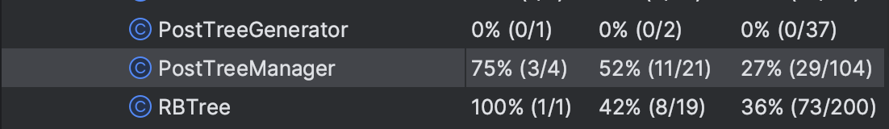

# [G0 - Team Name] Report

The following is a report template to help your team successfully provide all the details necessary for your report in a structured and organised manner. Please give a straightforward and concise report that best demonstrates your project. Note that a good report will give a better impression of your project to the reviewers.

Note that you should have removed ALL TEMPLATE/INSTRUCTION textes in your submission (like the current sentence), otherwise it hampers the professionality in your documentation.

*Here are some tips to write a good report:*

* `Bullet points` are allowed and strongly encouraged for this report. Try to summarise and list the highlights of your project (rather than give long paragraphs).*

* *Try to create `diagrams` for parts that could greatly benefit from it.*

* *Try to make your report `well structured`, which is easier for the reviewers to capture the necessary information.*

*We give instructions enclosed in square brackets [...] and examples for each sections to demonstrate what are expected for your project report. Note that they only provide part of the skeleton and your description should be more content-rich. Quick references about markdown by [CommonMark](https://commonmark.org/help/)*

## Table of Contents

1. [Team Members and Roles](#team-members-and-roles)
2. [Summary of Individual Contributions](#summary-of-individual-contributions)
3. [Application Description](#application-description)
4. [Application UML](#application-uml)
5. [Application Design and Decisions](#application-design-and-decisions)
6. [Summary of Known Errors and Bugs](#summary-of-known-errors-and-bugs)
7. [Testing Summary](#testing-summary)
8. [Implemented Features](#implemented-features)
9. [Team Meetings](#team-meetings)
10. [Conflict Resolution Protocol](#conflict-resolution-protocol)

## Administrative
- Firebase Repository Link: <insert-link-to-firebase-repository>
    - Confirm: I have already added comp21006442@gmail.com as a Developer to the Firebase project prior to due date.
- Two user accounts for markers' access are usable on the app's APK (do not change the username and password unless there are exceptional circumstances. Note that they are not real e-mail addresses in use):
    - Username: comp2100@anu.edu.au	Password: comp2100
    - Username: comp6442@anu.edu.au	Password: comp6442

## Team Members and Roles
The key area(s) of responsibilities for each member

| UID   |      Name      |                  Role |
|:------|:--------------:|----------------------:|
| [u7709429] | [Tianhao Shan] |                  [UI] |
| [u7776634] | [Haochen Gong] |      [Data structure] |
| [u7755061] |  [Yusi Zhong]  |        [Data prepare] |
| [u7733037] |     [Hongjun Xu]     |              [Search] |
| [u7725171] |     [Xing Chen]     | [User Interactivity ] |


## Summary of Individual Contributions

Specific details of individual contribution of each member to the project.

Each team member is responsible for writing **their own subsection**.

A generic summary will not be acceptable and may result in a significant lose of marks.

*[Summarise the contributions made by each member to the project, e.g. code implementation, code design, UI design, report writing, etc.]*

*[Code Implementation. Which features did you implement? Which classes or methods was each member involved in? Provide an approximate proportion in pecentage of the contribution of each member to the whole code implementation, e.g. 30%.]*

*you should ALSO provide links to the specified classes and/or functions*
Note that the core criteria of contribution is based on `code contribution` (the technical developing of the App).

*Here is an example: (Note that you should remove the entire section (e.g. "others") if it is not applicable)*

1. **u7709429, Tianhao Shan**  I have 20% contribution, as follows: <br>
- **Code Contribution in the final App**
    - Feature [LogIn] - class LoginActivity: [LoginActivity.java](https://gitlab.cecs.anu.edu.au/u7733037/gp-24s1/-/blob/main/src/app/src/main/java/com/example/compendiumofmateriamedica/LoginActivity.java)
    - Feature [Data-Profile] - class ProfileFragment: [ProfileFragment.java](https://gitlab.cecs.anu.edu.au/u7733037/gp-24s1/-/blob/main/src/app/src/main/java/com/example/compendiumofmateriamedica/ui/profile/ProfileFragment.java)
    - Splash Activity - class SplashActivity: [SplashActivity.java](https://gitlab.cecs.anu.edu.au/u7733037/gp-24s1/-/blob/main/src/app/src/main/java/com/example/compendiumofmateriamedica/SplashActivity.java)
    - Encapsulating Utils Methods - class UtilsApp:  [UtilsApp.java](https://gitlab.cecs.anu.edu.au/u7733037/gp-24s1/-/blob/main/src/app/src/main/java/model/UtilsApp.java)
    - Encapsulating Mutable Live Data - class ProfileViewModel.java [ProfileViewModel.java](https://gitlab.cecs.anu.edu.au/u7733037/gp-24s1/-/blob/main/src/app/src/main/java/com/example/compendiumofmateriamedica/ui/profile/ProfileViewModel.java)
    - Simple Frontend Development - class MainActivity: [MainActivity.java](https://gitlab.cecs.anu.edu.au/u7733037/gp-24s1/-/blob/main/src/app/src/main/java/com/example/compendiumofmateriamedica/MainActivity.java) - class MyPost: [MyPost.java](https://gitlab.cecs.anu.edu.au/u7733037/gp-24s1/-/blob/main/src/app/src/main/java/com/example/compendiumofmateriamedica/ui/profile/MyPost.java)

    <br>
- **Code and App Design**
    - Code refactoring: 
        - Refactoring of partial Java code, to improve the quality, extensibility of the codebase while preserving its functionality and compatibility with existing systems the code by the way of:
            1. Code Cleanup: Removing unused variables, imports, and dead code to improve readability and reduce clutter.
            2. Improving Code Structure: Reorganizing classes, methods, and files to follow better design patterns and coding conventions.
            3. Enhancing Comments and Documentation: Adding or improving comments to explain logic and algorithms, making the code easier to understand for other team members.
            4. Simplifying Complex Code: Breaking down long methods or classes into smaller, more manageable components to improve readability and maintainability.
      
        - Layout adjustment of all pages, to make the application more visually appealing, intuitive, and user-friendly by the way of:
            1. Justifying components: Changing the position, size and color of the components.
            2. Adding missing components: The 'back button' and some other reasonable components for each page and the jump logic behind them.
        
    - UI Design:
        - The UI Design of our application is divided into 5 sections: Social, Search, Profile, Item Description, and Login. I am responsible for Login and Profile section:
            1. Login section contains 'splash' and 'login' pages.
            2. Profile section contains the pages of 'user profile', 'list of discovered plants', 'list of posts', 'list of messages', 'privacy policy' and 'about us'.

       <br>

- **Others**:
    - Slides preparation <br><br>

2. **u7776634, Haochen Gong**  I have 20% contribution, as follows: <br>

- **Code Contribution in the final App**
    - Feature [Data-Formats] - class JsonReader: [JsonReader.java](https://gitlab.cecs.anu.edu.au/u7733037/gp-24s1/-/blob/main/src/app/src/main/java/model/Datastructure/JsonReader.java)
    - Feature [Data-GPS] - class PostShareActivity (GPS part): [PostShareActivity.java](https://gitlab.cecs.anu.edu.au/u7733037/gp-24s1/-/blob/main/src/app/src/main/java/com/example/compendiumofmateriamedica/PostShareActivity.java?ref_type=heads#L220-266)
    - Feature [LoadShowData] - class PlantDetailShow: [PlantDetailShow.java](https://gitlab.cecs.anu.edu.au/u7733037/gp-24s1/-/blob/main/src/app/src/main/java/com/example/compendiumofmateriamedica/PlantDetailShow.java)
    - Factory Design Pattern -  class TreeGenerator(interface): [generateTree()](https://gitlab.cecs.anu.edu.au/u7733037/gp-24s1/-/blob/main/src/app/src/main/java/model/Datastructure/TreeGenerator.java?ref_type=heads#L11-13), class UserTreeGenerator[generateTree()](https://gitlab.cecs.anu.edu.au/u7733037/gp-24s1/-/blob/main/src/app/src/main/java/model/Datastructure/UserTreeGenerator.java?ref_type=heads#L20-38), class PlantTreeGenerator[generateTree()](https://gitlab.cecs.anu.edu.au/u7733037/gp-24s1/-/blob/main/src/app/src/main/java/model/Datastructure/PostTreeGenerator.java?ref_type=heads#L27-76), class GeneratorFactory[tree()](https://gitlab.cecs.anu.edu.au/u7733037/gp-24s1/-/blob/main/src/app/src/main/java/model/Datastructure/GeneratorFactory.java?ref_type=heads#L22-41)
    - Storage structure of data(RB-tree) - class RBTree: [RBTree.java](https://gitlab.cecs.anu.edu.au/u7733037/gp-24s1/-/blob/main/src/app/src/main/java/model/Datastructure/RBTree.java), and class RBTreeNode: [RBTreeNode.java](https://gitlab.cecs.anu.edu.au/u7733037/gp-24s1/-/blob/main/src/app/src/main/java/model/Datastructure/RBTreeNode.java)
    - Class for Wrapping Tree Operation Methods(I completed the main parts of these classes, which were later refactored by a team member into the singleton pattern.) - class UserTreeManager: [UserTreeManager.java](https://gitlab.cecs.anu.edu.au/u7733037/gp-24s1/-/blob/main/src/app/src/main/java/model/Datastructure/UserTreeManager.java), class PlantTreeManager: [PlantTreeManager.java](https://gitlab.cecs.anu.edu.au/u7733037/gp-24s1/-/blob/main/src/app/src/main/java/model/Datastructure/PlantTreeManager.java), and class PostTreeManager: [PostTreeManager.java](https://gitlab.cecs.anu.edu.au/u7733037/gp-24s1/-/blob/main/src/app/src/main/java/model/Datastructure/PostTreeManager.java)
    - (Test)
      <br><br>

- **Code and App Design**
    - *The process of data reading and tree generation is divided into different classes, thus decoupling the logic of data reading and tree generation and making the code more modular and flexible.*
    - *The tree generation process is carried out using the factory pattern, and the implemented factory methods centralize the control process of data reading and tree generation, simplifying the main logic. The caller only needs to call the tree method and pass in the corresponding parameters to get the corresponding red-black tree without caring about the specific details of the generation.*
    - *All tree-specific operation methods are encapsulated into the corresponding TreeManager class , making the code structure more clear , the caller can find all tree operation methods in one place , easy to manage and maintain .*
    - <br><br>

- **Others**:
    - Video making, Report writing
    <br><br>

3. **u7755061, Yusi Zhong**  I have 20% contribution, as follows: <br>
- **Code Contribution in the final App**
    - Feature [DataFiles] - [posts.json](https://gitlab.cecs.anu.edu.au/u7733037/gp-24s1/-/blob/main/src/app/src/main/res/raw/posts.json), [plants.json](https://gitlab.cecs.anu.edu.au/u7733037/gp-24s1/-/blob/main/src/app/src/main/res/raw/plants.json), [users.json](https://gitlab.cecs.anu.edu.au/u7733037/gp-24s1/-/blob/main/src/app/src/main/res/raw/users.json), [posts_stream.json](https://gitlab.cecs.anu.edu.au/u7733037/gp-24s1/-/blob/main/src/app/src/main/res/raw/posts_stream.json)
    - Feature [FB-Auth] - [LoginAuth.java](https://gitlab.cecs.anu.edu.au/u7733037/gp-24s1/-/blob/main/src/app/src/main/java/model/Firebase/LoginAuth.java), [LoginViewModel](https://gitlab.cecs.anu.edu.au/u7733037/gp-24s1/-/blob/main/src/app/src/main/java/com/example/compendiumofmateriamedica/LoginViewModel.java)
  
- **Code and App Design**
    - *Chose JSON over XML for data storage due to better compatibility and performance within the app. JSON was selected because it is lightweight and easier to parse, which improved the app’s speed and responsiveness.*
    - *Data instances included real plant information and Wikipedia descriptions retrieved from APIs, while posts and user data were generated for development purposes.*
    - *Firebase provided a robust authentication mechanism, ensuring secure user logins and data protection. However, its persistence capabilities were limited due to data transfer restrictions and occasional instability.*
      <br><br>

- **Others**: (only if significant and significantly different from an "average contribution") 
    - Firebase: [firebase_bug branch](https://gitlab.cecs.anu.edu.au/u7733037/gp-24s1/-/tree/firebase_bug?ref_type=heads)<br>Initially implemented Firebase for data persistence but switched to local storage due to stability issues and data transfer limitations. This transition ensured better scalability and enhanced app reliability. The final submitted version does not include the related Firebase code, but integration attempts like firebase realtime database and could firestore are documented in the firebase_bug branch.*
    - Report writing
    <br><br>

4. **u7733037, Hongjun Xu**  I have 20% contribution, as follows: <br>
- **Code Contribution in the final App**
    - Feature [Search] - class [CaptureFragment](https://gitlab.cecs.anu.edu.au/u7733037/gp-24s1/-/blob/main/src/app/src/main/java/com/example/compendiumofmateriamedica/ui/capture/CaptureFragment.java?ref_type=heads), class [SearchGrammarParser](https://gitlab.cecs.anu.edu.au/u7733037/gp-24s1/-/blob/main/src/app/src/main/java/model/Parser/SearchGrammarParser.java?ref_type=heads), class [Token](https://gitlab.cecs.anu.edu.au/u7733037/gp-24s1/-/blob/main/src/app/src/main/java/model/Parser/Token.java?ref_type=heads), class [Tokenizer](https://gitlab.cecs.anu.edu.au/u7733037/gp-24s1/-/blob/main/src/app/src/main/java/model/Parser/Tokenizer.java?ref_type=heads), class [ParserEventHandler](https://gitlab.cecs.anu.edu.au/u7733037/gp-24s1/-/blob/main/src/app/src/main/java/model/Parser/ParserEventHandler.java?ref_type=heads), class [SearchedResults](https://gitlab.cecs.anu.edu.au/u7733037/gp-24s1/-/blob/main/src/app/src/main/java/com/example/compendiumofmateriamedica/SearchedResults.java?ref_type=heads)
    - Feature [Search-Invalid] - class ParserEventHandler: [getSearchedResultsFromParameters()](https://gitlab.cecs.anu.edu.au/u7733037/gp-24s1/-/blob/main/src/app/src/main/java/model/Parser/ParserEventHandler.java?ref_type=heads#L42-107), [getSearchedResultsFromBlurParameter()](https://gitlab.cecs.anu.edu.au/u7733037/gp-24s1/-/blob/main/src/app/src/main/java/model/Parser/ParserEventHandler.java?ref_type=heads#L110-165)
    - Facade Design Pattern - class PlantIdentification: [getPlantNetAPIResult()](https://gitlab.cecs.anu.edu.au/u7733037/gp-24s1/-/blob/main/src/app/src/main/java/model/PlantIdentification.java?ref_type=heads#L97-180), [getPlantNetAPIResultOKHttp()](https://gitlab.cecs.anu.edu.au/u7733037/gp-24s1/-/blob/main/src/app/src/main/java/model/PlantIdentification.java?ref_type=heads#L181-234), [getFromWiki()](https://gitlab.cecs.anu.edu.au/u7733037/gp-24s1/-/blob/main/src/app/src/main/java/model/PlantIdentification.java?ref_type=heads#L236-296)
    - Singleton Design Pattern - class [GeneralFunctions](https://gitlab.cecs.anu.edu.au/u7733037/gp-24s1/-/blob/main/src/app/src/main/java/com/example/compendiumofmateriamedica/GeneralFunctions.java?ref_type=heads)
    - HTTP API Request - class [PlantIdentification](https://gitlab.cecs.anu.edu.au/u7733037/gp-24s1/-/blob/1f8a3be3ebc86774e2ecec58f6e8a85b45f3914e/src/app/src/main/java/model/Plant_Identification.java)
    - Some APP recyclerviewAdapters functions
    - Some getter function in TreeManagers
    - (Test)
    
- **Code and App Design**
    - Data structure - RBTree
        - By hashing the special values in the data, new instances are re-inserted to improve the efficiency of subsequent tree searches.
    - Facade Design Pattern
        - I proposed to encapsulate the complex http interaction process into a method of obtaining plant parameters through the image path through the appearance design pattern.
    - UI Design - Cooperation Tools
        - To facilitate the collaborative design and discussion of team projects, we tried to use the online design tool "Miro" to interact and determine the general appearance of the APP UI.
    - UI Design - Rounded Corners
        - In order to prevent visual impact when users use it, I added some rounded corners, a soft and friendly visual experience. It can reduce visual impact, create a more relaxed and approachable appearance, and increase users’ willingness to interact.
    - 
    
<br><br>

5. **u7725171, Xing Chen**  I have 20% contribution, as follows: <br>
- **Code Contribution in the final App**
    - Feature DataStream - class [MyApp](https://gitlab.cecs.anu.edu.au/u7733037/gp-24s1/-/blob/main/src/app/src/main/java/com/example/compendiumofmateriamedica/MyApp.java?ref_type=heads), [NotificationService](https://gitlab.cecs.anu.edu.au/u7733037/gp-24s1/-/blob/main/src/app/src/main/java/com/example/compendiumofmateriamedica/NotificationService.java?ref_type=heads), [NewEvent](https://gitlab.cecs.anu.edu.au/u7733037/gp-24s1/-/blob/main/src/app/src/main/java/model/Datastructure/NewEvent.java?ref_type=heads), [NewEventHandler](https://gitlab.cecs.anu.edu.au/u7733037/gp-24s1/-/blob/main/src/app/src/main/java/model/Datastructure/NewEventHandler.java?ref_type=heads)
    - Feature Interact-Micro - class [PostAdapter](https://gitlab.cecs.anu.edu.au/u7733037/gp-24s1/-/blob/main/src/app/src/main/java/model/Adapters/PostAdapter.java?ref_type=heads), [SocialFragment](https://gitlab.cecs.anu.edu.au/u7733037/gp-24s1/-/blob/main/src/app/src/main/java/com/example/compendiumofmateriamedica/ui/social/SocialFragment.java?ref_type=heads), [SocialViewModel](https://gitlab.cecs.anu.edu.au/u7733037/gp-24s1/-/blob/main/src/app/src/main/java/com/example/compendiumofmateriamedica/ui/social/SocialViewModel.java?ref_type=heads), [PhotoDialogFragment](https://gitlab.cecs.anu.edu.au/u7733037/gp-24s1/-/blob/main/src/app/src/main/java/com/example/compendiumofmateriamedica/ui/social/PhotoDialogFragment.java?ref_type=heads)
    - Feature Interact-Share - class [PostShareActivity](https://gitlab.cecs.anu.edu.au/u7733037/gp-24s1/-/blob/main/src/app/src/main/java/com/example/compendiumofmateriamedica/PostShareActivity.java?ref_type=heads)
    - Feature Interact-Noti - class [MyApp](https://gitlab.cecs.anu.edu.au/u7733037/gp-24s1/-/blob/main/src/app/src/main/java/com/example/compendiumofmateriamedica/MyApp.java?ref_type=heads), [NotificationService](https://gitlab.cecs.anu.edu.au/u7733037/gp-24s1/-/blob/main/src/app/src/main/java/com/example/compendiumofmateriamedica/NotificationService.java?ref_type=heads), [NewEvent](https://gitlab.cecs.anu.edu.au/u7733037/gp-24s1/-/blob/main/src/app/src/main/java/model/Datastructure/NewEvent.java?ref_type=heads), [NewEventHandler](https://gitlab.cecs.anu.edu.au/u7733037/gp-24s1/-/blob/main/src/app/src/main/java/model/Datastructure/NewEventHandler.java?ref_type=heads), [NotificationAdapter](https://gitlab.cecs.anu.edu.au/u7733037/gp-24s1/-/blob/main/src/app/src/main/java/model/Adapters/NotificationAdapter.java?ref_type=heads), [MessagesActivity](https://gitlab.cecs.anu.edu.au/u7733037/gp-24s1/-/blob/main/src/app/src/main/java/com/example/compendiumofmateriamedica/ui/profile/Messages.java?ref_type=heads)
    - Feature Data-Profile, Data-Formats - class [ProfileFragment](https://gitlab.cecs.anu.edu.au/u7733037/gp-24s1/-/blob/main/src/app/src/main/java/com/example/compendiumofmateriamedica/ui/profile/ProfileFragment.java?ref_type=heads), [ProfilePage](https://gitlab.cecs.anu.edu.au/u7733037/gp-24s1/-/blob/main/src/app/src/main/java/com/example/compendiumofmateriamedica/ui/profile/ProfilePage.java?ref_type=heads), [MyPost](https://gitlab.cecs.anu.edu.au/u7733037/gp-24s1/-/blob/main/src/app/src/main/java/com/example/compendiumofmateriamedica/ui/profile/MyPost.java?ref_type=heads), [PlantDiscovered](https://gitlab.cecs.anu.edu.au/u7733037/gp-24s1/-/blob/main/src/app/src/main/java/com/example/compendiumofmateriamedica/ui/profile/PlantDiscovered.java?ref_type=heads)
    - Singleton Design Pattern - [Class PostTreeManager, methods getInstance()](https://gitlab.cecs.anu.edu.au/u7733037/gp-24s1/-/blob/main/src/app/src/main/java/model/Datastructure/PostTreeManager.java?ref_type=heads#L18-35), [Class PlantTreeManager, methods getInstance()](https://gitlab.cecs.anu.edu.au/u7733037/gp-24s1/-/blob/main/src/app/src/main/java/model/Datastructure/PlantTreeManager.java?ref_type=heads#L21-32), [Class UserTreeManager, methods getInstance()](https://gitlab.cecs.anu.edu.au/u7733037/gp-24s1/-/blob/main/src/app/src/main/java/model/Datastructure/UserTreeManager.java?ref_type=heads#L21-32), [Class NewEventHandler, methods getInstance()](https://gitlab.cecs.anu.edu.au/u7733037/gp-24s1/-/blob/main/src/app/src/main/java/model/Datastructure/NewEventHandler.java?ref_type=heads#L24-35)
    - Observer Design Pattern - class NewEventHandler, MainActivity, ProfileFragment
    - Camera use - class CaptureFragment
    - ImageLoader function
    - Some getter function
    -

- **Code and App Design**
    - Singleton Design Pattern
        - I proposed that applying this design pattern on the data structure manager and event handler will significantly reduce memory usage.
    - Capturing new events in Application layer
        - User can get notification anywhere during the app is running. This will be more user-friendly.
    - UI design
        - Show user level in profile page to give user a target to chase so that user could have momentum.
<br><br>


## Application Description

*Compendium of Materia Medica is a social application aimed at plant enthusiasts, providing detailed information about various plants, including image examples, common names, slugs, scientific names, genus, and family information, along with extensive textual descriptions. Users can obtain plant information by taking photos of plants they encounter or by searching directly using text. Additionally, users can post their own photos of plants on the social channel to share their discoveries and experiences with all users. Following this, by clicking the profile icon, users can access their personal information, including published posts, their plant discovery book, and plant exploration energy values.*


### Application Use Cases and or Examples

*Targets Users:  People who are interested in plants or want to learn about them*

* *Users can like their favorite posts on social channels, and the users who are liked will receive a message reminder.*
* *Users can take pictures of unknown plants encountered in life through the application, and the application will return the relevant information of the plant; At the same time, the user can choose to upload the photo of the plant to the social channel to share with other users, if the plant is discovered by the user for the first time, the user will increase the energy value of plant exploration after sharing, and at the same time store the plant information in the discovery book.*
* *Users can view their own relevant information in the profile interface, such as published posts, plant collection guides, and plant exploration energy values.*
* *Users can search for a specific plant by entering information about the plant (such as common name, etc.) to get detailed information about the plant, and the app will also provide posts posted by other users related to the plant.*
* *When users clicks on the image of a plant from the search results, they can enter the plant's detail display page, which includes the plant's official image and detailed information.*

  <br>

*Use Case Diagram:*
<br>


<hr> 

### Application UML

 <br>

<hr>

## Code Design and Decisions

<hr>

### Data Structures

*I used the following data structures in my project:*

1. *Arraylist*
    * *Objective: used for storing JSONObject data read from a json file for [Data-Formats] feature.*
    * *Code Locations: processed using: storing data to Arraylist in [Class JsonReader, methods readJsonFromFile()](https://gitlab.cecs.anu.edu.au/u7733037/gp-24s1/-/blob/main/src/app/src/main/java/model/Datastructure/JsonReader.java?ref_type=heads#L27-56); reading data from Arraylist in [generateTree() in Class UserTreeGenerator](https://gitlab.cecs.anu.edu.au/u7733037/gp-24s1/-/blob/main/src/app/src/main/java/model/Datastructure/UserTreeGenerator.java?ref_type=heads#L20-38) and [generateTree() in Class PlantTreeGenerator](https://gitlab.cecs.anu.edu.au/u7733037/gp-24s1/-/blob/main/src/app/src/main/java/model/Datastructure/PlantTreeGenerator.java?ref_type=heads#L19-40) and [generateTree() in Class PostTreeGenerator](https://gitlab.cecs.anu.edu.au/u7733037/gp-24s1/-/blob/main/src/app/src/main/java/model/Datastructure/PostTreeGenerator.java?ref_type=heads#L27-76) (All of these methods implement from [generateTree() in Interface TreeGenerator](https://gitlab.cecs.anu.edu.au/u7733037/gp-24s1/-/blob/main/src/app/src/main/java/model/Datastructure/TreeGenerator.java?ref_type=heads#L11-13))*
    * *Reasons:*
        * *Our scenario requires iterating over large datasets without needing to modify them. Therefore, Arraylist, with its contiguous storage and cache efficiency, is more suitable than complex structures like linked lists or hash tables due to its superior iteration performance.*

2. *Red-Black Tree*
    * *Objective: used for storing all the data in the app that needs to be read and loaded.*
    * *Code Locations: defined in [Class RBTree](https://gitlab.cecs.anu.edu.au/u7733037/gp-24s1/-/blob/main/src/app/src/main/java/model/Datastructure/RBTree.java?ref_type=heads#L14-335) and [Class RBTreeNode](https://gitlab.cecs.anu.edu.au/u7733037/gp-24s1/-/blob/main/src/app/src/main/java/model/Datastructure/RBTreeNode.java?ref_type=heads#L7-74); processed using: create tree in [generateTree() in Class UserTreeGenerator](https://gitlab.cecs.anu.edu.au/u7733037/gp-24s1/-/blob/main/src/app/src/main/java/model/Datastructure/UserTreeGenerator.java?ref_type=heads#L20-38) and [generateTree() in Class PlantTreeGenerator](https://gitlab.cecs.anu.edu.au/u7733037/gp-24s1/-/blob/main/src/app/src/main/java/model/Datastructure/PlantTreeGenerator.java?ref_type=heads#L19-40) and [generateTree() in Class PostTreeGenerator](https://gitlab.cecs.anu.edu.au/u7733037/gp-24s1/-/blob/main/src/app/src/main/java/model/Datastructure/PostTreeGenerator.java?ref_type=heads#L27-76); Insertion, deletion and search methods for trees in [all methods in Class UserTreeManager](https://gitlab.cecs.anu.edu.au/u7733037/gp-24s1/-/blob/main/src/app/src/main/java/model/Datastructure/UserTreeManager.java?ref_type=heads#L35-92) and [all methods in Class PlantTreeManager](https://gitlab.cecs.anu.edu.au/u7733037/gp-24s1/-/blob/main/src/app/src/main/java/model/Datastructure/PlantTreeManager.java?ref_type=heads#L34-95) and [all methods in Class PostTreeManager](https://gitlab.cecs.anu.edu.au/u7733037/gp-24s1/-/blob/main/src/app/src/main/java/model/Datastructure/PostTreeManager.java?ref_type=heads#L37-147)*
    * *Reasons:*
        * *For the three types of data in our application (user,plant,post), we need to do a lot of search operations, and all three types of data have unique ID. By using the ID as the key, red-black tree ensures that in the worst case, the time complexity of looking up any element is O(logN), which guarantees the efficiency of the searching.*
        * *For post data, frequent insertion and deletion operations are required, and the time complexity of red-black tree for insertion and deletion is also O(logN), which improves the efficiency in the dynamically changing data environment.*
        * *The data within the red-black tree is ordered, which makes it easy to do range queries, such as finding users or posts within a specific ID range.*

3. *HashMap*
   * *Objective: Used for mapping object IDs to their occurrence counts to store search results.*
   * *Code Locations: processed using: ParserEventHandler class, [getSearchedResultsFromParameters()](https://gitlab.cecs.anu.edu.au/u7733037/gp-24s1/-/blob/main/src/app/src/main/java/model/Parser/ParserEventHandler.java?ref_type=heads#L32-107) method is used for creating mappings, and [getIDListFromSearchedResults()](https://gitlab.cecs.anu.edu.au/u7733037/gp-24s1/-/blob/main/src/app/src/main/java/model/Parser/ParserEventHandler.java?ref_type=heads#L167-197) method utilizes these mappings.*
   * *Reasons:*
       * *HashMap provides rapid access and update speeds for basic operations such as retrieval and storage. Assuming the hash function properly disperses the elements, these operations have an average time complexity of O(1), which is ideal for our needs in handling large volumes of search data quickly.*
       * *HashMap is particularly suitable for implementing complex search logics, such as AND and OR conditions. In AND searches, we return only those IDs whose occurrence counts match the number of search parameters; in OR searches, we return any ID that has appeared.*
       * *HashMap does not maintain the order of elements, which saves overhead in our app as there is no need to maintain the order of search results.*
       * *HashMap allows us to use one null key and multiple null values, providing flexibility in handling incomplete or optional data. This is beneficial when processing user inputs or search parameters that might sometimes be unspecified or missing.*
       * *HashMap can automatically expand its array of buckets, which helps us effectively manage data growth, optimize memory usage, and prevent operational delays.*

<hr>

### Design Patterns
*[What design patterns did your team utilise? Where and why?]*

1. *Factory Pattern*
    * *Objective: used for the unified creation and configuration of red-black trees for different data types(user, plant and post).*
    * *Code Locations: defined in*
      *[Interface TreeGenerator](https://gitlab.cecs.anu.edu.au/u7733037/gp-24s1/-/blob/main/src/app/src/main/java/model/Datastructure/TreeGenerator.java?ref_type=heads#L11-13)*
      *[Class UserTreeGenerator, methods generateTree()](https://gitlab.cecs.anu.edu.au/u7733037/gp-24s1/-/blob/main/src/app/src/main/java/model/Datastructure/UserTreeGenerator.java?ref_type=heads#L20-38)*
      *[Class PlantTreeGenerator, methods generateTree()](https://gitlab.cecs.anu.edu.au/u7733037/gp-24s1/-/blob/main/src/app/src/main/java/model/Datastructure/PlantTreeGenerator.java?ref_type=heads#L19-40)*
      *[Class PostTreeGenerator, methods generateTree()](https://gitlab.cecs.anu.edu.au/u7733037/gp-24s1/-/blob/main/src/app/src/main/java/model/Datastructure/PostTreeGenerator.java?ref_type=heads#L27-76)*
      *[Class GeneratorFactory, methods tree()](https://gitlab.cecs.anu.edu.au/u7733037/gp-24s1/-/blob/main/src/app/src/main/java/model/Datastructure/GeneratorFactory.java?ref_type=heads#L22-41)*
      *processed using*
      *[Class LoginActivity, methods DataInitial()](https://gitlab.cecs.anu.edu.au/u7733037/gp-24s1/-/blob/main/src/app/src/main/java/com/example/compendiumofmateriamedica/LoginActivity.java?ref_type=heads#L173-177)*
    * *Reasons:*
        * The project needs to deal with three different data types, each with its own specific properties and behavior. By implementing a factory pattern, it is possible to design separate tree generators for each data type, e.g., UserTreeGenerator, PlantTreeGenerator, PostTreeGenerator.This design allows each generator to focus on the logic of handling a specific type of data, thus improving the readability and maintainability of the code. This improves code readability and maintainability.
        * Using the factory pattern allows apps to easily add new data type handlers in the future without affecting the existing code structure. By simply adding a new TreeGenerator implementation, new datatypes can be seamlessly integrated without modifying the core logic of the factory.
        * The factory method tree() provides a simple interface for clients to obtain the required data structures by encapsulating the details of data reading, parsing and tree generation. The client does not need to know the underlying implementation details, but only needs to specify the required data types and resource identifiers. This reduces the complexity of client-side operations and makes the code clearer and easier to manage.
        * The factory pattern also makes it easier to monitor and optimize the tree generation process. If a particular type of data tree generation is inefficient, the generator for that type can be targeted and optimized without modifying the processing logic for other types.

2. *Singleton Pattern*
    * *Objective: used for ensuring all components interacts with the same set of data, maintaining consistent operations such as insertions, deletions, and searches across activities.*
    * *Code Locations: defined in*
        * [Class PostTreeManager, methods getInstance()](https://gitlab.cecs.anu.edu.au/u7733037/gp-24s1/-/blob/main/src/app/src/main/java/model/Datastructure/PostTreeManager.java?ref_type=heads#L18-35)
        * [Class PlantTreeManager, methods getInstance()](https://gitlab.cecs.anu.edu.au/u7733037/gp-24s1/-/blob/main/src/app/src/main/java/model/Datastructure/PlantTreeManager.java?ref_type=heads#L21-32)
        * [Class UserTreeManager, methods getInstance()](https://gitlab.cecs.anu.edu.au/u7733037/gp-24s1/-/blob/main/src/app/src/main/java/model/Datastructure/UserTreeManager.java?ref_type=heads#L21-32)
        * [Class NewEventHandler, methods getInstance()](https://gitlab.cecs.anu.edu.au/u7733037/gp-24s1/-/blob/main/src/app/src/main/java/model/Datastructure/NewEventHandler.java?ref_type=heads#L24-35)
    * *Reasons:*
        * Controlled Initialization: Guarantees managers are properly initialized with an RBTree<T> before use, preventing errors from premature use.
        * Resource Efficiency: Saves memory and processing power by preventing the creation of multiple instances of data management objects.
        * Thread Safety: The synchronized getInstance method ensures each manager is created once, protecting against data corruption in multi-thread environments.
        * Consistency and Integrity: Ensures all parts of the app work with the same data instance, maintaining data integrity and avoiding discrepancies.

3. *Observer Pattern*
    * *Objective: Enable user to get notification when user's posts are liked by others. We also use this in some UI updating case.*
    * *Code Locations: defined in*
        * Class NewEventHandler
        * Class
    * *Reasons:*
        * Our app is a social app so user will be interested in other user's action and reaction.
        * Decoupling between classes.
        * Realtime updates.
        * Better for system with massive number of users like ours.
4. Facade Pattern
    -   *Objective: To simplify the process from photo image path to HTTP request and from retrieving JSON data via the API to further processing, and to make it repeatable.*
    -   *Code Locations: defined in*
        -   Class [PlantIdentification](https://gitlab.cecs.anu.edu.au/u7733037/gp-24s1/-/blob/main/src/app/src/main/java/model/PlantIdentification.java?ref_type=heads)
    -   *Reasons:*
        -   Code maintainability: The process from the captured photo path to obtaining usable data is too complex, and there are no additional local variables involved in the process. To simplify this and facilitate the maintenance of other code, we encapsulate the entire process into a single class.
        -   Thread Safety: Since API calls rely on external servers, the overall performance is unstable. Encapsulating these calls separately and establishing them on an independent thread will help ensure the security of the runtime environment.
        -   Scalability: Due to the presence of various data types in the app, each requiring different API calls (such as plant identification, retrieving detailed content descriptions, obtaining related images, etc.), this design pattern can provide functional scalability for other calls.

<hr>

### Parser

### <u>Grammar(s)</u>
Since our Parser is mainly used for the syntax of data searching, and the main purpose of the search syntax is to allow users to obtain more accurate or more generic search results, the syntax mainly considers the compatibility of the overall syntax and its scalability. More specifically, when searching for plants in the search project, users can accurately search for plants within a certain range based on information such as the plant's family, scientific name, or content with similar descriptions. Similarly, when users search for plant-related posts, they can also find related posts more accurately based on information about the relevant plants and attributes such as time range.

In addition, considering that various attributes of the data will gradually enrich as the content of the database expands, we need to enhance the compatibility of the syntax to some extent so that when new attributes appear, they can be matched with search content through the syntax one by one.

Therefore, after careful consideration, the current search syntax can be mainly divided into three parts: tag columns, parameter columns, and search method columns, each represented by an identifier followed by a content box. The identifiers are as follows:

|            | Column Identifier |
| ---------- | ----------------- |
| Tag Column | #:                |
| Param Column | $:                |
| Search Method Column | *:                |

Regarding the search method column, according to the current needs of the app, it is temporarily defined as two search logics, AND and OR, representing more accurate search and broader search respectively. The content of each identifier is separated by commas and can be freely assigned. This design allows the tag content to correspond one-to-one with the parameter content and is easy for users to remember. The expression of the search syntax is in the format of `[]: {}`, stacked in this format.

Production Rules:

     <Exp>        := <TagColumn>, <TextColumn>, <METHOD> | <TextColumn>, <TagColumn>, <METHOD>
     <TagColumn>  := #: { <Content> },
     <TextColumn> := $: { <Content> },
     <Method>     := *: {&} | *: {|}
     <Content>    := STR | STR, <Content>

In summary, the current syntax has a certain level of compatibility, scalability, and readability.


### <u>Tokenizers and Parsers</u>

To address the input issues in human-computer interaction, our tokenizer is currently mainly used in two scenarios: the syntax of searches and the textual content of posted threads.

Firstly, concerning the syntax of searches, in order to enhance the efficiency of the parser and tokenize the lexemes, we first convert the user's syntax input into a list of tokens before proceeding with subsequent syntax processing. This approach ensures that the syntax symbols input by the user meet expectations (no illegal characters or garbled code) before entering the parser, thereby improving the efficiency of syntax logic processing.

Since the logic of natural language understanding is generally unidirectional, our tokenizer logic sequentially examines the input stream to extract the current character if it matches a key character, placing it into the token list, and continues stacking the current character until the next corresponding character group is found.

The algorithmic expression is detailed as follows:

```
1. Initialize an empty Token List object to store all tokens.
2. Enter a loop while there are still unprocessed tokens.
   3. Add the current token to the Token List in the loop.
      4. Trim the whitespace from the current buffer.
      5. If the buffer is empty, set the current token to null to indicate no remaining tokens and then end the method.
      6. Get the first character in the buffer and identify the token type based on different character types.
      7. Generate the corresponding Token object based on the first character and set it as the current token.
      8. If the first character satisfies the character requirements, enter a loop and read consecutive characters until encountering a character that does not meet the requirements.
         9. Treat this part of characters as a token string, generate a Token object, and set it as the current token.
      10. If the first character does not match any of the above cases, throw an exception indicating an unexpected token.
      11. Remove the current token from the buffer.
   12. Repeat step 3 until there are no remaining tokens.
13. Return the Token List storing all tokens.
```

Next, for the algorithm of search syntax, we can split the recognition of syntax into multiple sub-logic blocks, as described in the previous section on `Grammar(s)`, processing from the top-level `ExpParser` to the bottom-level `ContentParser` to identify semantics. Since the complexity of syntax was considered during initial syntax design, the processing of each logic block is relatively simple. Usually, we only need to confirm whether the substring has the expected characters at the beginning and end, greatly enhancing the efficiency of syntax processing. When handling the backend, all substrings of tag columns and parameter columns are integrated into a HashMap and transmitted back to the frontend, along with the current search method. Then, further processing can be performed by calling the search() method of a red-black tree based on the obtained search syntax parameters and methods until obtaining a list of all plant/Post IDs satisfying the user's syntax.

When users input incorrect tokens or syntax, we can also isolate the content corresponding to the current token search column and search the subsequent part, without needing to exit the entire syntax processing logic, as with a single string.

Additionally, when users post threads, we similarly tokenize their textual inputs. This enables quick identification of user-entered keywords, allowing us to rapidly implement a sensitive word filtering function to effectively block inappropriate content. To facilitate other users' efficient search for thread content, we tokenize threads and search for keywords one by one. This processing approach makes search methods more efficient and faster.


<br>

<hr>

## Implemented Features

### Basic Features
1. [LogIn]. Users must be able to log in (not necessarily sign up).  (easy)
    * Code: class LoginActivity: [LoginActivity.java](https://gitlab.cecs.anu.edu.au/u7733037/gp-24s1/-/blob/main/src/app/src/main/java/com/example/compendiumofmateriamedica/LoginActivity.java)
    * This page is for user to log into the application.
    * The page will prompt the user to enter the email and password in the corresponding input area, and then the data obtained will be compared with the data inside the RB tree structure for all users' information, prompting "Login successful" if the data is matched and entry into the app with passing the information of the current user, or prompting the user to "Invalid email or password" if the data is not matched.

2. [DataFiles]. Create at least 2500 valid data instances. (easy)
    * Code to the Data File [posts.json](https://gitlab.cecs.anu.edu.au/u7733037/gp-24s1/-/blob/main/src/app/src/main/res/raw/posts.json), [plants.json](https://gitlab.cecs.anu.edu.au/u7733037/gp-24s1/-/blob/main/src/app/src/main/res/raw/plants.json), [users.json](https://gitlab.cecs.anu.edu.au/u7733037/gp-24s1/-/blob/main/src/app/src/main/res/raw/users.json), [posts_stream.json](https://gitlab.cecs.anu.edu.au/u7733037/gp-24s1/-/blob/main/src/app/src/main/res/raw/posts_stream.json)
    * Link to the Firebase repo: https://console.firebase.google.com/project/gp-24s1-fb08c/overview?hl=zh-cn
    * Plants includes plant names, images, common names, scientific names, genus, family, and extensive descriptions, it sourced from APIs, ensuring accuracy and relevance.
    * Posts and users were generated for development purposes, providing a realistic dataset for testing the app’s social features.

3. [LoadShowData]. Implemented a page that shows information about a single plant instance. (easy)
    * Code: class PlantDetailShow: [PlantDetailShow.java](https://gitlab.cecs.anu.edu.au/u7733037/gp-24s1/-/blob/main/src/app/src/main/java/com/example/compendiumofmateriamedica/PlantDetailShow.java)
    * The page will search for the plant in the generated plantTree based on the plant id passed in, and add the relevant attributes of the plant instance to the textView of the page.

4. [DataStream]. After a user logs in, a background service periodically generates events where random users like the current app user's post. The user can see notifications of new events and handle them. (medium)
   * Code: NotificationService.java
   * The service will generate a new event representing other user's like action periodically.
   * The service will also simulate other user sharing posts, reading post information from json.
   * The social page can do real-time update when someone share a new post.
   * If the app user's newest post has less than 6 likes, it will be liked by a random user.
   * User will get notification both as system notification and UI updates.
   <br>
5. [Search]. (medium)
    -   Code: Class [Token](https://gitlab.cecs.anu.edu.au/u7733037/gp-24s1/-/blob/main/src/app/src/main/java/model/Parser/Token.java?ref_type=heads), Class [Tokenizer](https://gitlab.cecs.anu.edu.au/u7733037/gp-24s1/-/blob/main/src/app/src/main/java/model/Parser/Tokenizer.java?ref_type=heads), Class [SearchGrammarParser](https://gitlab.cecs.anu.edu.au/u7733037/gp-24s1/-/blob/main/src/app/src/main/java/model/Parser/SearchGrammarParser.java?ref_type=heads), Class [ParserEventHandler](https://gitlab.cecs.anu.edu.au/u7733037/gp-24s1/-/blob/main/src/app/src/main/java/model/Parser/ParserEventHandler.java?ref_type=heads)
    -   Users can search for two types of objects, "Plant" and "Post," using a switch. Depending on the currently selected object, when the app performs a syntax-based search, it will generate a corresponding result list based on the search logic and display it on the page for users to view in detail.
    -   When a user inputs a search query, the program first tokenizes the input and then interprets the specific logical content of the syntax (by Class Tokenizer, Class Token). 
    -   At this stage, the backend of the app obtains a reference table of the search content derived from the syntax and the search method (e.g., "AND", "OR") (by Class ParserEventHandler, Class SearchGrammarParser). 
    -   Based on the information provided in the table, it generates a corresponding list of plant or post IDs, then navigates to the search results display page, and loads the specific content through these IDs (by Class SearchGrammarParser, methods getIDListFromSearchedResults, Class SearchedResults).

### Custom Features

Feature Category: Firebase Integration <br>
1. [FB-Auth]. Implemented Firebase Authentication for secure user login and management. Users authenticate using their email and password. (easy)
    * Code: [LoginAuth.java](https://gitlab.cecs.anu.edu.au/u7733037/gp-24s1/-/blob/main/src/app/src/main/java/model/Firebase/LoginAuth.java), [LoginViewModel](https://gitlab.cecs.anu.edu.au/u7733037/gp-24s1/-/blob/main/src/app/src/main/java/com/example/compendiumofmateriamedica/LoginViewModel.java)
    * The LoginAuth class handles user authentication, while the LoginActivity class manages user login UI and interaction. Upon successful authentication, users are redirected to the main activity of the application.


Feature Category: User Interactivity <br>
2. [Interact-Micro] User can like other users' posts by clicking the like button. (easy)
    * Code: class [PostAdapter](https://gitlab.cecs.anu.edu.au/u7733037/gp-24s1/-/blob/main/src/app/src/main/java/model/Adapters/PostAdapter.java?ref_type=heads#)
    * If the post is already liked by user, clicking like button will unlike it.

3. [Interact-Share] User can share post after taking photo of plants. (easy)
    * Code: class [PostShareActivity](https://gitlab.cecs.anu.edu.au/u7733037/gp-24s1/-/blob/main/src/app/src/main/java/com/example/compendiumofmateriamedica/PostShareActivity.java?ref_type=heads), [CaptureFragment](https://gitlab.cecs.anu.edu.au/u7733037/gp-24s1/-/blob/main/src/app/src/main/java/com/example/compendiumofmateriamedica/ui/capture/CaptureFragment.java?ref_type=heads)
    * Click the camera icon in Capture page, the app will call camera of the cellphone.
    * After taking a photo of plant, user can post this photo with some content and share it with other user in Social page.

4. [Interact-Noti] User can get notifications when user's post is liked. (medium)
    * Code: class [NotificationService](https://gitlab.cecs.anu.edu.au/u7733037/gp-24s1/-/blob/main/src/app/src/main/java/com/example/compendiumofmateriamedica/NotificationService.java?ref_type=heads)
    * If user's newest post has less than 6 likes, the backstage service will simulate other user liking this post.
    * User can see how many unread messages he has now. After checking the messages, the number will be reset to 0.
    * If the unread notifications are more than 3, user will get system notification.

Feature Category: Greater Data Usage, Handling and Sophistication <br>
5. [Data-Profile] Profile page has a user level icon. (easy)
    * Code: class [ProfileFragment](https://gitlab.cecs.anu.edu.au/u7733037/gp-24s1/-/blob/main/src/app/src/main/java/com/example/compendiumofmateriamedica/ui/profile/ProfileFragment.java?ref_type=heads), [ProfilePage](https://gitlab.cecs.anu.edu.au/u7733037/gp-24s1/-/blob/main/src/app/src/main/java/com/example/compendiumofmateriamedica/ui/profile/ProfilePage.java?ref_type=heads), [PostAdapter](https://gitlab.cecs.anu.edu.au/u7733037/gp-24s1/-/blob/main/src/app/src/main/java/model/Adapters/PostAdapter.java?ref_type=heads)
    * Based on how many plants user has discovered, the profile page will display different level icon.
    * There is a process bar showing how many plants left to level up.
    * User level will also be shown in his posts.

6. [Data-Formats] We read JSON and mp3 file from local files. (easy)
    * Code: [class JsonReader](https://gitlab.cecs.anu.edu.au/u7733037/gp-24s1/-/blob/main/src/app/src/main/java/model/Datastructure/JsonReader.java),class PostAdapter [initSoundPool(),releaseSoundPool()](https://gitlab.cecs.anu.edu.au/u7733037/gp-24s1/-/blob/main/src/app/src/main/java/model/Adapters/PostAdapter.java?ref_type=heads#L175-196)
    * Read data from JSON: We read local JSON files(all data of our app) from the `res/raw` directory in our Android app, then we use the `JsonReader` class to open the resource file as an `InputStream`, read its contents with a `BufferedReader`, and parse the data into an `ArrayList` of `JSONObject`s.
    * Read music from mp3: Sounds are stored as mp3 files in the `res/raw` directory and are loaded and played using a SoundPool. For instance, when a user likes a post, the play() method of SoundPool is called to play the sound effect identified by R.raw.sound_like.

7. [Data-GPS] Users can get information about their current location. (easy)
    * Code: [class PostShareActivity](https://gitlab.cecs.anu.edu.au/u7733037/gp-24s1/-/blob/main/src/app/src/main/java/com/example/compendiumofmateriamedica/PostShareActivity.java?ref_type=heads#L220-266)
    * When a user shares a post, the user's current gps location is automatically obtained
    * The share post page uses Geocoder to get the current latitude and longitude, which are then sent to the server to request the address.

Feature Category: Search-related features
1.  [Search-Invalid] The app will correct user typos to a certain extent and continue the search based on the corrected input.
    -   Code: Class ParserEventHandler, method [getSearchedResultsFromParameters()](https://gitlab.cecs.anu.edu.au/u7733037/gp-24s1/-/blob/main/src/app/src/main/java/model/Parser/ParserEventHandler.java?ref_type=heads#L32-107), [getSearchedResultsFromBlurParameter()](https://gitlab.cecs.anu.edu.au/u7733037/gp-24s1/-/blob/main/src/app/src/main/java/model/Parser/ParserEventHandler.java?ref_type=heads#L110-165), [calculateStringSimilarity()](https://gitlab.cecs.anu.edu.au/u7733037/gp-24s1/-/blob/main/src/app/src/main/java/model/Parser/ParserEventHandler.java?ref_type=heads#L230-273)
    -   When performing a search, if the user's input contains a specific term that is not found in the data, the program will automatically conduct a similar term search. It will then use the term with the highest similarity which similarity is larger than 0.5 to the original term as the key for a new search. If no similar term is found, the current search will be skipped.

<hr>

### Surprise Features

1. [Using singleton Design Pattern]
  - We found that because we instantiate trees and TreeManagers in  several activities and in fact we are using the same one.
  - This requires more memory and is hard for activities to synchronize data.
  - Thus, we apply singleton design pattern on all of this TreeManagers and use getInstance() to get the unique instance.
  - By doing this, our app requires less memory and the code is more neat and readable.

2. [Refactored the return value of all search methods in all treeManager class]
  - When checking the code, we noticed that the search method in the TreeManager class returns a list of tree nodes. This requires an extra step to call the `getValue` method on the tree nodes to obtain the actual instances, indicating incomplete encapsulation.
  - So we'll perform the operation of getting the node value earlier in the search method, thus changing the return value of all search methods from a list of nodes to a list of instances.
  - By doing this, we make it easier for the backend to make calls to the search method, increasing the readability and ease of use of the code.


- If implemented, explain how your solution addresses the task (any detail requirements will be released with the surprise feature specifications).
- State that "Suprised feature is not implemented" otherwise.

<br> <hr>

## Summary of Known Errors and Bugs

*[Where are the known errors and bugs? What consequences might they lead to?]*
*List all the known errors and bugs here. If we find bugs/errors that your team does not know of, it shows that your testing is not thorough.*

*Here is an example:*

1. *Bug 1:*
    - *A space bar (' ') in the sign in email will crash the application.*
    - ...

2. *Bug 2:*
3. ...

<br> <hr>


## Testing Summary

*[What features have you tested? What is your testing coverage?]*
*Please provide some screenshots of your testing summary, showing the achieved testing coverage. Feel free to provide further details on your tests.*

*Here is an example:*

1. Tests for Tokenizer
    - Code: [TokenizerTest Class, entire file](https://gitlab.cecs.anu.edu.au/u7733037/gp-24s1/-/blob/main/src/app/src/test/java/com/example/compendiumofmateriamedica/TokenizerTest.java) for the [Tokenizer Class, entire file](https://gitlab.cecs.anu.edu.au/u7733037/gp-24s1/-/blob/main/src/app/src/main/java/model/Parser/Tokenizer.java)
    - *Number of test cases: 4*
    - *Code coverage: *
    - *Types of tests created and descriptions:*
    - *testAllTokenBasic(): Tests all basic token types to ensure the tokenizer correctly identifies and handles different types of tokens.*
    - *testMidTokenCase(): Tests mid-token types to ensure the tokenizer correctly processes strings containing text, separators, and other tokens.*
    - *testAdvancedTokenResult(): Tests advanced token processing to ensure the tokenizer correctly handles complex input strings and generates the expected token sequence.*
    - *testExceptionToken(): Tests illegal token input to ensure the tokenizer throws an IllegalTokenException when encountering unrecognizable tokens.*
    <br><br>
2. Tests for Grammar Parser
    - Code: [GrammarParserTest Class, entire file](https://gitlab.cecs.anu.edu.au/u7733037/gp-24s1/-/blob/main/src/app/src/test/java/com/example/compendiumofmateriamedica/GrammarParserTest.java) for the [SearchGrammarParser Class, entire file](https://gitlab.cecs.anu.edu.au/u7733037/gp-24s1/-/blob/main/src/app/src/main/java/model/Parser/SearchGrammarParser.java)
    - *Number of test cases: 3*
    - *Code coverage: *
    - *Types of tests created and descriptions:*
    - *testSimpleConvert(): Tests simple grammar conversions to ensure that the input strings are correctly converted to the expected key-value pairs and checks the search method type.*
    - *testAdvanceConvert(): Tests advanced grammar conversions to ensure that the input string is correctly converted to the expected results with multiple key-value pairs.*
    - *testIllegalProductionException(): Tests if illegal grammar inputs correctly throw the IllegalProductionException.*
      <br><br>
3. Tests for Singleton
    - Code: [SingletonTest Class, entire file](https://gitlab.cecs.anu.edu.au/u7733037/gp-24s1/-/blob/main/src/app/src/androidTest/java/com/example/compendiumofmateriamedica/SingletonTest.java) for the [PostTreeManager](https://gitlab.cecs.anu.edu.au/u7733037/gp-24s1/-/blob/main/src/app/src/main/java/model/Datastructure/PostTreeManager.java?ref_type=heads#L26-49), [UserTreeManager](https://gitlab.cecs.anu.edu.au/u7733037/gp-24s1/-/blob/main/src/app/src/main/java/model/Datastructure/UserTreeManager.java?ref_type=heads#L19-37), [PlantTreeManager](https://gitlab.cecs.anu.edu.au/u7733037/gp-24s1/-/blob/main/src/app/src/main/java/model/Datastructure/PlantTreeManager.java?ref_type=heads#L17-35) and [NotificationAdapter](https://gitlab.cecs.anu.edu.au/u7733037/gp-24s1/-/blob/main/src/app/src/main/java/model/Adapters/NotificationAdapter.java?ref_type=heads#L33-57) Class.
    - *Number of test cases: 4*
    - *Code coverage: Result:*
    - 
    - *Types of tests created and descriptions:*
    - *Using reflection to create newinstance, getInstance() and multi-thread environment for each class*
    - *testPostTreeManagerSingleton(): Verifies that PostTreeManager correctly implements the singleton pattern.*
    - *testUserTreeManagerSingleton(): Verifies that UserTreeManager correctly implements the singleton pattern.*
    - *testPlantTreeManagerSingleton(): Verifies that PlantTreeManager correctly implements the singleton pattern.*
    - *testNotificationAdapterSingleton(): Verifies that NotificationAdapter correctly implements the singleton pattern.*
      <br><br>
4. Tests for UserTreeManager
    - Code: [UserTreeManagerTest Class, entire file](https://gitlab.cecs.anu.edu.au/u7733037/gp-24s1/-/blob/main/src/app/src/test/java/com/example/compendiumofmateriamedica/UserTreeManagerTest.java?ref_type=heads#L1-109) for the [UserTreeManager Class, entire file](https://gitlab.cecs.anu.edu.au/u7733037/gp-24s1/-/blob/main/src/app/src/main/java/model/Datastructure/UserTreeManager.java?ref_type=heads)
    - *Number of test cases: 9*
    - *Code coverage: *
    - *Types of tests created and descriptions:*
    - *testInsert(): Verifies that a new user can be correctly inserted into the UserTreeManager.*
    - *testDelete(): Verifies that a user can be correctly deleted from the UserTreeManager.*
    - *testSearchByID(): Verifies that a user can be searched in the UserTreeManager by their user ID.*
    - *testSearchByName(): Verifies that a user can be searched in the UserTreeManager by their username.*
    - *testSearchByEmail(): Verifies that a user can be searched in the UserTreeManager by their email.*
    - *testSearchByAvatar(): Verifies that a user can be searched in the UserTreeManager by their avatar.*
    - *testGetAllUser(): Verifies that all users can be retrieved from the UserTreeManager.*
    - *testFindUserById(): Verifies that a user can be found in the UserTreeManager by their user ID.*
    - *testSingleton(): Verifies that the UserTreeManager correctly implements the singleton pattern.*
      <br><br>
5. Tests for PlantTreeManager
    - Code: [PlantTreeManagerTest Class, entire file](https://gitlab.cecs.anu.edu.au/u7733037/gp-24s1/-/blob/main/src/app/src/test/java/com/example/compendiumofmateriamedica/PlantTreeManagerTest.java?ref_type=heads#L1-114) for the [PlantTreeManager Class, entire file](https://gitlab.cecs.anu.edu.au/u7733037/gp-24s1/-/blob/main/src/app/src/main/java/model/Datastructure/PlantTreeManager.java?ref_type=heads#L1-128)
    - *Number of test cases: 10*
    - *Code coverage: *
    - *Types of tests created and descriptions:*
    - *testInsert(): Verifies that a new plant can be correctly inserted into the PlantTreeManager.*
    - *testDelete(): Verifies that a plant can be correctly deleted from the PlantTreeManager.*
    - *testSearchByCommonName(): Verifies that a plant can be searched in the PlantTreeManager by its common name.*
    - *testSearchBySlug(): Verifies that a plant can be searched in the PlantTreeManager by its slug.*
    - *testSearchByScientificName(): Verifies that a plant can be searched in the PlantTreeManager by its scientific name.*
    - *testSearchByGenus(): Verifies that a plant can be searched in the PlantTreeManager by its genus.*
    - *testSearchByFamily(): Verifies that a plant can be searched in the PlantTreeManager by its family.*
    - *testSingleton(): Verifies that the PlantTreeManager correctly implements the singleton pattern.*
    - *testGetTypeByString(): Verifies that the correct PlantInfoType enum value can be retrieved by string.*
    - *testGetTypeByStringInvalid(): Verifies that an exception is correctly thrown when an invalid string is passed.*
      <br><br>
6. Tests for PostTreeManager
    - Code: [PostTreeManagerTest Class, entire file](https://gitlab.cecs.anu.edu.au/u7733037/gp-24s1/-/blob/main/src/app/src/test/java/com/example/compendiumofmateriamedica/PostTreeManagerTest.java?ref_type=heads#L1-84) for the [PostTreeManager Class, method: getNewestPosts()](https://gitlab.cecs.anu.edu.au/u7733037/gp-24s1/-/blob/main/src/app/src/main/java/model/Datastructure/PostTreeManager.java?ref_type=heads#L131-151) and [PostTreeManager Class, method:insert(), delete()](https://gitlab.cecs.anu.edu.au/u7733037/gp-24s1/-/blob/main/src/app/src/main/java/model/Datastructure/PostTreeManager.java?ref_type=heads#L53-60)
    - *Number of test cases: 3*
    - *Code coverage: *
    - *Types of tests created and descriptions:*
    - *testInsert(): Verifies that a new post can be correctly inserted into the PostTreeManager.*
    - *testDelete(): Verifies that a post can be correctly deleted from the PostTreeManager.*
    - *testGetNewestPosts(): Verifies that the newest posts can be retrieved from the PostTreeManager based on a timestamp.*

<br> <hr>


## Team Management

### Meetings Records

- *[Team Meeting 1](https://gitlab.cecs.anu.edu.au/u7733037/gp-24s1/-/blob/main/items/meeting-1.md)*
- *[Team Meeting 2](https://gitlab.cecs.anu.edu.au/u7733037/gp-24s1/-/blob/main/items/meeting-2.md)*
- *[Team Meeting 3](https://gitlab.cecs.anu.edu.au/u7733037/gp-24s1/-/blob/main/items/meeting-3.md)*
- *[Team Meeting 4](https://gitlab.cecs.anu.edu.au/u7733037/gp-24s1/-/blob/main/items/meeting-4.md)*

<hr>

### Conflict Resolution Protocol
<br><br>
1. Failure to Meet Initial Plan or Deadlines：
- Schedule weekly progress meetings to review the status of each member's tasks.
- During these meetings, identify any potential delays early and adjust the plan accordingly.
- If a member consistently fails to meet deadlines, their tasks can be reassigned to other members who have the capability and time to complete them, ensuring the project stays on track.
<br><br>

2. Reaching Consensus or Solving Problems within the Team：
- Establish a group chat (e.g., WeChat) where all members can discuss issues and share progress.
- Use a voting system to reach consensus, ensuring every member's opinion is heard and considered.
- If internal conflicts cannot be resolved, involve a mentor or a third-party mediator to help the team reach an agreement.
<br><br>

3. Addressing Unforeseen Incidents like Member Sickness:
- Maintain flexibility in task assignments, allowing the team to adjust based on actual circumstances.
- Encourage team members to support each other, and temporarily redistribute workloads if necessary to cope with unexpected situations.

